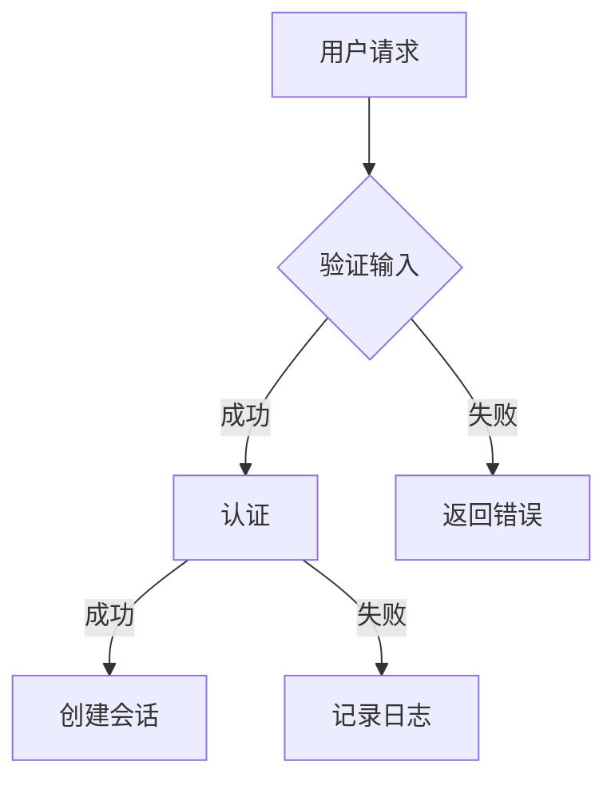

# Code Summarizer / 代码总结生成器

## Overview

深入分析代码的**执行流程**、**核心方法**、**实现难点**和**设计巧思**，生成结构化的 markdown 总结文档。文档头部包含 TL;DR 摘要，突出难点和亮点。

## When to Use

- 中文：总结这段代码、这段代码怎么工作的、分析代码流程、代码导读、代码难点
- English：summarize this code、explain this code flow、how does this work、code summary、key methods、core difficulties
- 接手新代码时快速理解
- Code review 时总结关键点
- 写文档前的资料收集

**输出方式**：代码简单则直接对话输出；代码复杂则询问用户是否生成 md 文档。

## Output

根据代码复杂度选择输出方式：

- **简单代码**（单一文件、方法少、流程清晰）→ 直接在对话中输出
- **复杂代码**（多文件、多层调用、复杂状态）→ 询问用户是否生成 md 文档
  - 用户要文档 → 生成 `docs/code-summary/{filename}.md`
  - 用户要对话 → 在对话中输出完整总结

## 复杂度判断标准

满足以下任意一条视为**复杂**：
- 文件数量 ≥ 3 个
- 核心方法 ≥ 5 个
- 调用层级 ≥ 3 层
- 有异步/Promise 链或状态机
- 涉及外部 I/O（网络、文件、数据库）

均不满足 → **简单**，直接对话输出。

## 执行流程

```
1. Identify target — 确定要分析的代码文件/模块
2. Read files — 读取目标代码文件
3. Assess complexity — 判断复杂度
   - 满足复杂标准？→ 询问用户输出方式
4a. 用户要求文档 → 生成 docs/code-summary/{filename}.md
4b. 用户要求对话 / 代码简单 → 对话中输出总结
5. 输出结果（文件或对话）
```

## 对话输出格式（简单代码 / 用户选择对话）

当直接对话输出时，使用以下紧凑格式：

```markdown
## {文件名} 代码总结

**一句话**：...（TL;DR）

**执行流程**：步骤1 → 步骤2 → 步骤3

**核心方法**：
- `method()` — 职责

**难点**：
- ...

**亮点**：
- ...
```


## Summary Document Structure

### 文件头摘要（TL;DR）

```markdown
---
file: {filename}
summary: 一句话描述代码做什么
difficulty: 难点：...
cleverness: 亮点：...
---

# {文件名} 代码总结

## 执行流程
[步骤1] → [步骤2] → [步骤3]

## 核心方法

| 方法 | 作用 | 复杂度 |
|------|------|--------|
| methodA | 做xxx | O(n) |

## 设计巧思
- ...

## 核心难点
- ...
```

## 分析维度

### 1. 执行流程 (Execution Flow)

追踪代码的执行路径：
- 入口点（entry point）
- 主要控制流
- 分支处理
- 循环逻辑
- 返回路径

### 2. 核心方法 (Key Methods)

识别最重要的方法/函数：
- 主要业务逻辑
- 数据转换
- 状态管理
- 对外接口

### 3. 设计巧思 (Clever Design)

识别代码中的亮点：
- 巧妙的数据结构选择
- 高效的算法
- 优雅的模式应用
- 简洁的实现
- 有启发性的代码组织

### 4. 核心难点 (Core Difficulties)

识别最困难的部分：
- 复杂业务逻辑
- 嵌套的状态管理
- 边界条件处理
- 非直观的设计决策
- 需要领域知识才能理解的部分

## Output Format Examples

### 头部摘要格式

```markdown
---
file: src/auth/login.ts
summary: 处理用户登录流程，验证凭证并生成会话 token
difficulty: 难点：多层验证逻辑与错误处理的状态机转换
cleverness: 亮点：使用装饰器模式统一处理多种认证方式
---
```

### 执行流程格式

使用 **ASCII ART** 绘制简单流程，**Mermaid** 用于复杂流程。

**简单流程（ASCII ART）：**
```markdown
## 执行流程

```
用户请求 ──→ [validateInput] ──→ [authenticate] ──→ [createSession] ──→ 返回 token
                                         │
                                         ↓ 失败
                                   [记录日志] ──→ 返回错误
```
```

**复杂流程（Mermaid）：**
```markdown
## 执行流程


```

### 核心方法格式

```markdown
## 核心方法

| 方法 | 职责 | 复杂度 | 备注 |
|------|------|--------|------|
| `validateCredentials()` | 验证用户名密码 | O(1) | 字典查找 |
| `generateToken()` | 生成 JWT | O(1) | HS256 |
| `rotateRefreshToken()` | 轮换刷新令牌 | O(1) | 防重放 |
```

## 文件命名

生成的文件保存到 `docs/code-summary/` 目录：
- 单文件：`{original-filename}.md`
- 多文件模块：`{module-name}-summary.md`

## Tools Used

- `Read` — 读取目标代码文件
- `Grep` — 搜索函数定义、调用关系
- `Glob` — 查找相关文件
- `Agent (Explore)` — 复杂模块深度分析
- `Write` — 生成 markdown 文档

## 注意事项

1. **先读代码，再总结** — 不要猜测，基于实际代码分析
2. **难点要具体** — 不仅说"复杂"，要说明哪里复杂、为什么复杂
3. **巧思要解释why** — 不仅说"巧妙"，要说明这样设计的好处
4. **TL;DR 要精炼** — 一两句话说清楚代码是干啥的
5. **保持客观** — 如实反映代码质量，优点缺点都提
6. **询问语气自然** — 问用户是否要生成文档时，语气像提建议而非例行公事
