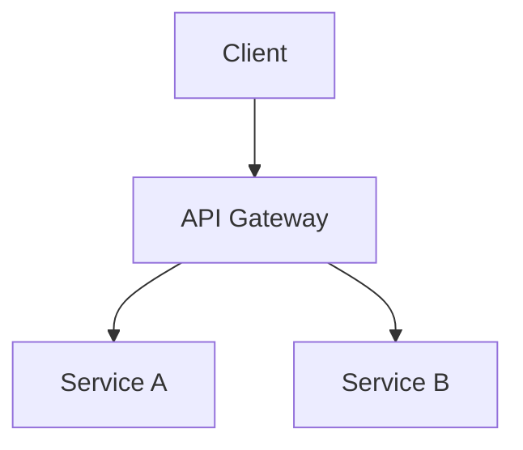

# Codebase Documenter / 代码库文档生成器

## Overview

分析目标代码库的结构、技术栈、关键组件，生成结构化文档。支持两种深度：
- **Quick（默认）**：项目概览、目录结构、技术栈、关键组件
- **Standard**：+ 数据流图（Mermaid）、架构决策、外部集成、入口点分析

---

## When to Use / 触发场景

**Quick（默认）:**
- 中文：分析项目结构、解释这个代码库、文档化架构、生成代码概览
- English：analyze codebase、explain this code、document architecture、generate codebase overview

**Standard（显式指定）:**
- 中文：详细分析、完整文档、深入分析
- English：detailed analysis、full documentation、deep dive

---

## Depth Levels / 深度级别

### Quick (Default) / 快速模式

**Duration:** 5-10 min

**Covers:**
- 项目概览（Purpose, Tech Stack, Status）
- 目录结构分析（Entry points, Core modules, Config locations）
- 关键组件识别（Major modules, Responsibilities）

**Output:**
- Conversation: Structured analysis
- File: `docs/codebase/OVERVIEW.md`

### Standard / 完整模式

**Duration:** 15-30 min

**Covers:**
- Everything in Quick
- 数据流图（Mermaid sequence/flow diagrams）
- 架构决策记录（Architecture decisions）
- 外部集成分析（APIs, Databases, Auth, Caching）
- 入口点追踪（Entry point analysis）

**Output:**
- Conversation: Comprehensive analysis
- Files:
  - `docs/codebase/README.md` — 文档入口 + 概览
  - `docs/codebase/OVERVIEW.md` — 完整内容
  - `docs/codebase/ARCHITECTURE.md` — 架构图 + 数据流

---

## Process / 执行流程

```
1. 解析 depth level（默认 Quick，显式关键词切换 Standard）
2. Glob 扫描项目结构
   - Root: package.json, README.md, tsconfig.json, etc.
   - Src: 扫描 src/ lib/ app/ 等核心目录
3. 读取关键文件
   - README.md, package.json, config files
   - Entry point files (main, index)
4. (Standard only) Explore agent — thorough 模式深度探索
5. Grep 提取模式
   - imports/exports (模块关系)
   - routes (Web frameworks)
   - API endpoints
   - Database models/schemas
6. 合成输出
   - 对话输出结构化分析
   - Write 写入 docs/codebase/ 目录
```

---

## Output Format / 输出格式

### Quick Output

```markdown
## 项目概览

| 项目 | 内容 |
|------|------|
| 项目名称 | ... |
| 技术栈 | ... |
| 入口文件 | ... |
| 包管理器 | ... |

## 目录结构

```
project/
├── src/          # ...
├── tests/        # ...
└── ...
```

## 关键组件

| 组件 | 职责 | 文件 |
|------|------|------|
| ... | ... | ... |
```

### Standard Output — ARCHITECTURE.md

```markdown
## 架构图



## 数据流

1. 用户请求 → ...
2. ...
```

---

## Tools Used

- `Glob` — 项目结构扫描
- `Read` — README、配置文件、入口文件
- `Grep` — imports/exports/routes/patterns
- `Agent (Explore, thorough)` — Standard 深度探索
- `Write` — 生成文档文件
- `Bash` — git metadata、版本信息
