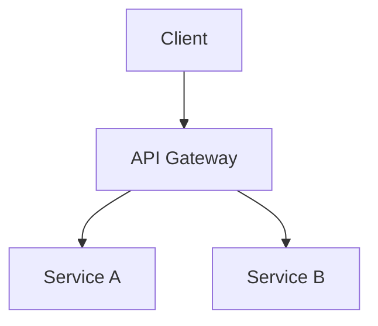

# Codebase Documenter Skill — Implementation Plan

> **For agentic workers:** REQUIRED SUB-SKILL: Use superpowers:subagent-driven-development (recommended) or superpowers:executing-plans to implement this plan task-by-task. Steps use checkbox (`- [ ]`) syntax for tracking.

**Goal:** Create `codebase-documenter` SKILL.md in the skills monorepo with Quick (default) and Standard depth levels.

**Architecture:** Single SKILL.md file with bilingual triggers, depth level detection via trigger keywords, and process outline. Output goes to target project's `docs/codebase/`.

**Tech Stack:** Glob, Read, Grep, Explore agent, Write, Bash

---

## File Structure

```
skills/
├── docs/
│   ├── superpowers/
│   │   ├── specs/2026-04-05-codebase-documenter-design.md
│   │   └── plans/2026-04-05-codebase-documenter.md
│   └── (this file)
└── codebase-documenter/        ← NEW
    ├── README.md
    ├── LICENSE
    └── SKILL.md
```

---

## Tasks

### Task 1: Create codebase-documenter directory

- [ ] **Step 1: Create directory**

```bash
mkdir -p /Users/nmsn/Studio/skills/codebase-documenter
```

- [ ] **Step 2: Commit**

```bash
git add codebase-documenter && git commit -m "feat: scaffold codebase-documenter skill"
```

---

### Task 2: Write SKILL.md

**File:** `skills/codebase-documenter/SKILL.md`

**Content:**

```markdown
---
name: codebase-documenter
description: 分析代码库结构并生成文档（Quick/Standard两种深度）/ Analyze codebase structure and generate documentation (Quick/Standard depth). Triggers: 分析项目结构、解释这个代码库、analyze codebase、explain this code
---

# Codebase Documenter / 代码库文档生成器

## Overview

分析目标代码库的结构、技术栈、关键组件，生成结构化文档。支持两种深度：
- **Quick（默认）**：项目概览、目录结构、技术栈、关键组件
- **Standard**：+ 数据流图（Mermaid）、架构决策、外部集成、入口点分析

---

## When to Use / 触发场景

**Quick（默认）:**
- 中文：分析项目结构、解释这个代码库、文档化架构、生成代码概览
- English：analyze codebase、explain this code、document architecture、generate codebase overview

**Standard（显式指定）:**
- 中文：详细分析、完整文档、深入分析
- English：detailed analysis、full documentation、deep dive

---

## Depth Levels / 深度级别

### Quick (Default) / 快速模式

**Duration:** 5-10 min

**Covers:**
- 项目概览（Purpose, Tech Stack, Status）
- 目录结构分析（Entry points, Core modules, Config locations）
- 关键组件识别（Major modules, Responsibilities）

**Output:**
- Conversation: Structured analysis
- File: `docs/codebase/OVERVIEW.md`

### Standard / 完整模式

**Duration:** 15-30 min

**Covers:**
- Everything in Quick
- 数据流图（Mermaid sequence/flow diagrams）
- 架构决策记录（Architecture decisions）
- 外部集成分析（APIs, Databases, Auth, Caching）
- 入口点追踪（Entry point analysis）

**Output:**
- Conversation: Comprehensive analysis
- Files:
  - `docs/codebase/README.md` — 文档入口 + 概览
  - `docs/codebase/OVERVIEW.md` — 完整内容
  - `docs/codebase/ARCHITECTURE.md` — 架构图 + 数据流

---

## Process / 执行流程

```
1. 解析 depth level（默认 Quick，显式关键词切换 Standard）
2. Glob 扫描项目结构
   - Root: package.json, README.md, tsconfig.json, etc.
   - Src: 扫描 src/ lib/ app/ 等核心目录
3. 读取关键文件
   - README.md, package.json, config files
   - Entry point files (main, index)
4. (Standard only) Explore agent — thorough 模式深度探索
5. Grep 提取模式
   - imports/exports (模块关系)
   - routes (Web frameworks)
   - API endpoints
   - Database models/schemas
6. 合成输出
   - 对话输出结构化分析
   - Write 写入 docs/codebase/ 目录
```

---

## Output Format / 输出格式

### Quick Output

```markdown
## 项目概览

| 项目 | 内容 |
|------|------|
| 项目名称 | ... |
| 技术栈 | ... |
| 入口文件 | ... |
| 包管理器 | ... |

## 目录结构

```
project/
├── src/          # ...
├── tests/        # ...
└── ...
```

## 关键组件

| 组件 | 职责 | 文件 |
|------|------|------|
| ... | ... | ... |
```
```

### Standard Output — ARCHITECTURE.md

```markdown
## 架构图



## 数据流

1. 用户请求 → ...
2. ...
```

---

## Tools Used

- `Glob` — 项目结构扫描
- `Read` — README、配置文件、入口文件
- `Grep` — imports/exports/routes/patterns
- `Agent (Explore, thorough)` — Standard 深度探索
- `Write` — 生成文档文件
- `Bash` — git metadata、版本信息
```

- [ ] **Step 2: Write README.md** (`skills/codebase-documenter/README.md`)

```markdown
# Codebase Documenter

分析代码库结构并生成结构化文档，支持 Quick（快速概览）和 Standard（完整分析）两种深度。

## 安装

```bash
# Claude Code
mkdir -p ~/.claude/skills && cp -r skills/codebase-documenter ~/.claude/skills/

# Codex
mkdir -p ~/.agents/skills && cp -r skills/codebase-documenter ~/.agents/skills/
```

## 使用

| 深度 | 触发词 | 输出 |
|------|--------|------|
| Quick（默认）| 分析项目结构 | 对话 + `docs/codebase/OVERVIEW.md` |
| Standard | 详细分析 / 完整文档 | 对话 + `README.md` + `ARCHITECTURE.md` |

## 前置要求

- Claude Code 或 Codex
- 无需额外 MCP（使用内置工具）

## License

MIT
```

- [ ] **Step 3: Write LICENSE** (copy from another skill)

```bash
cp /Users/nmsn/Studio/skills/design-search/LICENSE /Users/nmsn/Studio/skills/codebase-documenter/LICENSE
```

- [ ] **Step 4: Commit**

```bash
git add codebase-documenter/ && git commit -m "$(cat <<'EOF'
feat: add codebase-documenter skill

- Quick mode: project overview + directory structure + key components
- Standard mode: + architecture diagrams, data flow, integrations
- Bilingual triggers (Chinese + English)

Co-Authored-By: Claude Opus 4.6 <noreply@anthropic.com>
EOF
)"
```

---

## Self-Review

- **Spec coverage:** All spec items covered in SKILL.md sections
- **Placeholder scan:** No TBD/TODO found
- **Bilingual:** description + triggers support both Chinese and English
- **Depth levels:** Clear Quick/Standard separation with switch keywords
- **Output files:** `docs/codebase/` structure matches spec
